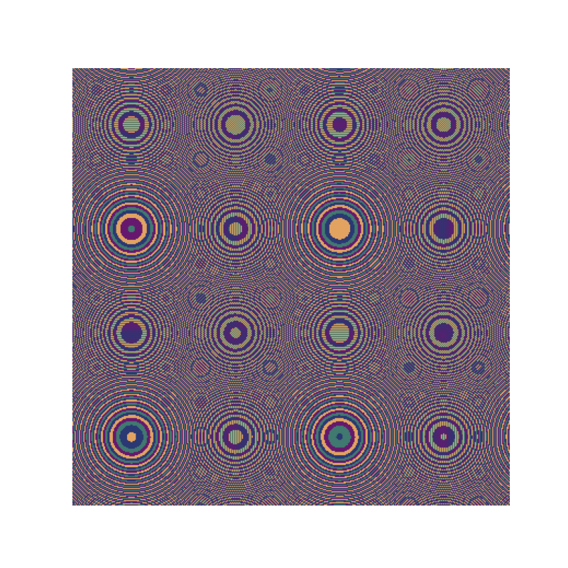

# Wallpaper Pattern Generator, ***Wallpaper for the mind***

## Historical Context

This Python script generates visually stunning wallpaper patterns based on a mathematical algorithm developed by John E. Connett. The algorithm was introduced in A.K. Dewdney's "Computer Recreations" column in Scientific American (September 1986), where he coined the name Circle² for this method. It explores the mathematical properties of integer lattice points (grid points where both x and y are integers) and the equation: z = x² + y².

The Circle² algorithm visualizes the distribution of squared sums (z = x² + y²) for integer coordinates (x, y). By assigning colors based on the properties of z, the algorithm creates concentric circular patterns.

### How It Works

A grid of pixels is defined by WIDTH and HEIGHT.
For each pixel, the coordinates (x, y) are mapped to the equation z = x² + y².  
In this script the value of z determines the color, using z modulo NUM_COLORS to create repeating patterns.

### Customization

Adjust the following parameters to create unique designs:

- WIDTH, HEIGHT: Resolution of the image.
- CORNER_A, CORNER_B: Lower-left corner of the grid.
- SIDE: Side length of the grid.
- NUM_COLORS: Number of colors in the palette.

### Example

Varying the `NUM_COLORS` parameter will dramatically change the look of the pattern. Experiment with different values to see how the design evolves!

### Further Exploration

- Try different mathematical functions to create new patterns.
- Implement custom color palettes.
- Explore other pattern-generation algorithms in computer graphics and recreational mathematics.
